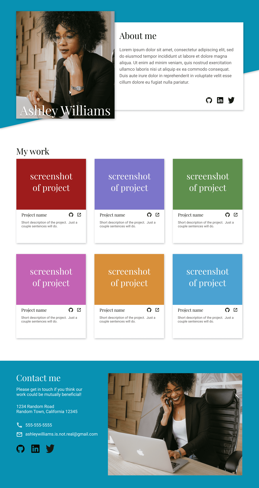

# Mohamed Mosilhy — Developer Portfolio

A responsive personal portfolio homepage presenting Mohamed Mosilhy's developer profile, selected projects, technical interests, and contact information. The site is intentionally lightweight and is implemented with semantic HTML and custom CSS.

[View the live portfolio](https://mohamedmosilhy.github.io/Homepage/) · [View the source](https://github.com/mohamedmosilhy/Homepage)



## Project overview

The page is divided into three focused areas:

- A profile introduction describing full-stack, biomedical, AI, mobile, and desktop experience
- A responsive project gallery linking to nine GitHub repositories
- A contact section with location, phone, email, GitHub, and LinkedIn details

The current project cards link to source repositories for TEO, LDB Landing Page, Battleship, Weather App, Todo List, Restaurant Page, Library, Tic Tac Toe, and Admin Dashboard.

## Features

- Responsive desktop, tablet, and mobile layouts
- Profile-led hero section
- Multi-column project card grid
- Direct GitHub and LinkedIn links
- Contact details with recognizable iconography
- Accessible alternative text for profile imagery
- Lightweight static delivery with no runtime JavaScript

## Built with

- HTML5
- CSS3
- CSS Grid and Flexbox
- Responsive media queries
- Font Awesome
- Google Fonts (Playfair Display and Roboto)

Google Fonts and Font Awesome are loaded from their respective CDNs, so an internet connection is required for the intended typography and icons.

## Project structure

```text
Homepage/
├── assets/
│   ├── portfolio.png
│   ├── portfolio tablet.png
│   ├── portfolio mobile.png
│   └── profile and contact icons
├── index.html
├── styles.css
└── README.md
```

## Run locally

```bash
git clone https://github.com/mohamedmosilhy/Homepage.git
cd Homepage
```

Open `index.html` directly or serve the directory with a static web server. No installation or build command is required.

## Customization

Portfolio content is maintained in `index.html`, while layout, colors, typography, and responsive behavior live in `styles.css`. Project cards are static markup, making it straightforward to replace links or add new work without introducing a framework.
